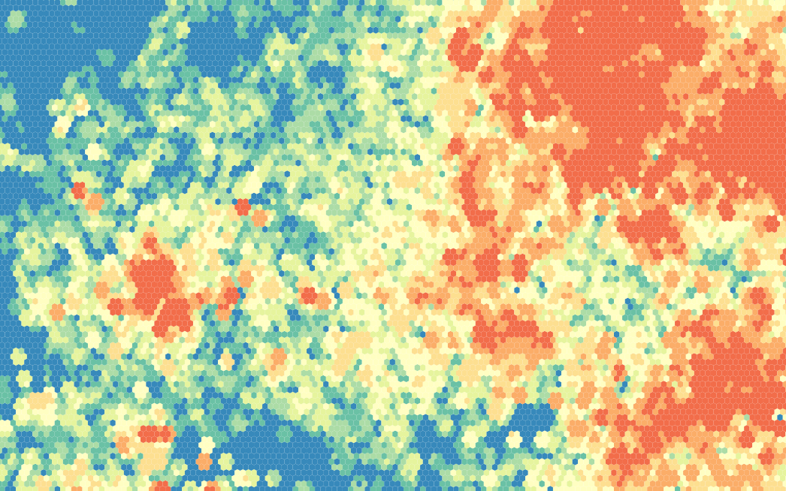

som_visualization_r
===================

THe kohonen packagen in R, while useful, has really crappy visualization capabilities.  These are a series of functions to allow visualization of component planes and U-matrices for large SOMs.  They borrow from http://nbremer.blogspot.com/ for drawing hexagonal lattices and from the plotting functions implemented in kohonen.  These are rudimentary functions, no real error handling,  but they work and make pretty pictures.  Users can choose between equal interval and quantile bins for the u-matrix and component planes.  I've currently hard-coded the scale under the assumption that people will standardize their data prior to fitting a SOM, the legend now assumes all data has a zero mean and a unit variance, anything more than 1.5 SD away from the mean gets put into the highest/lowest bin.  

These functions have a lot of dependencies, including fields, network, kohonen, and RColorBrewer.  Feedback and improvements welcome.  Thanks.

-SS 
